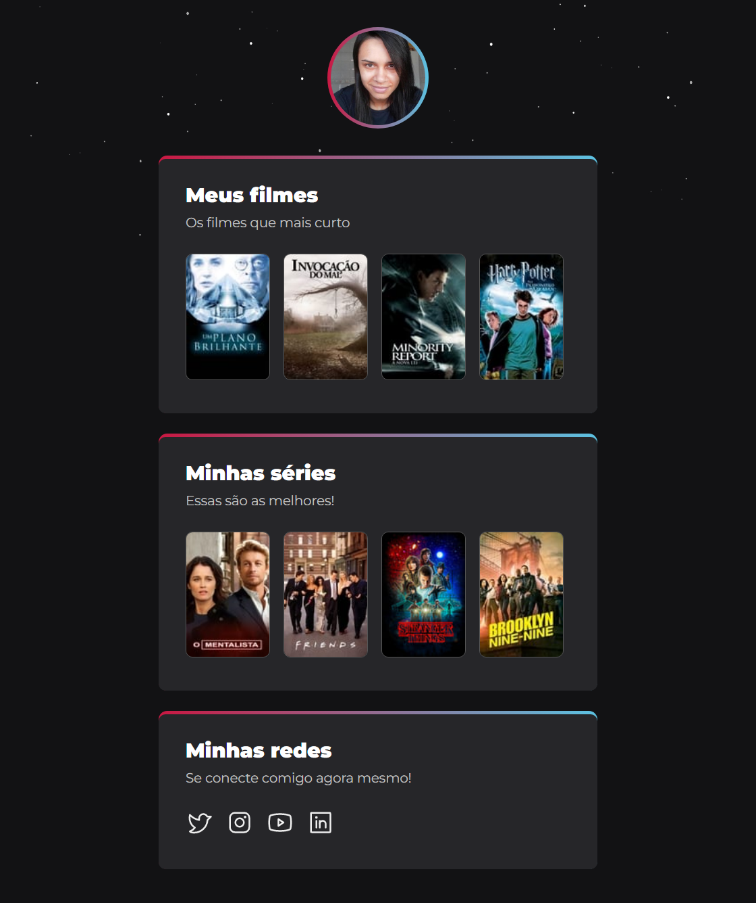

# NLW eSports (desafio extra)

> Trilha Explorer

## Projeto construído com base em protótipo do Figma, disponibilizado no evento Next Level Week, da Rocketseat.

🔗 <a href="https://julietedias.github.io/nlw-esports-desafio-extra/" target="_blank">Clique aqui para acessar</a>

## 💻 Tecnologias
- HTML
- CSS
- Git e Github

## 📩 Contato
juliete_dias@outlook.com.br